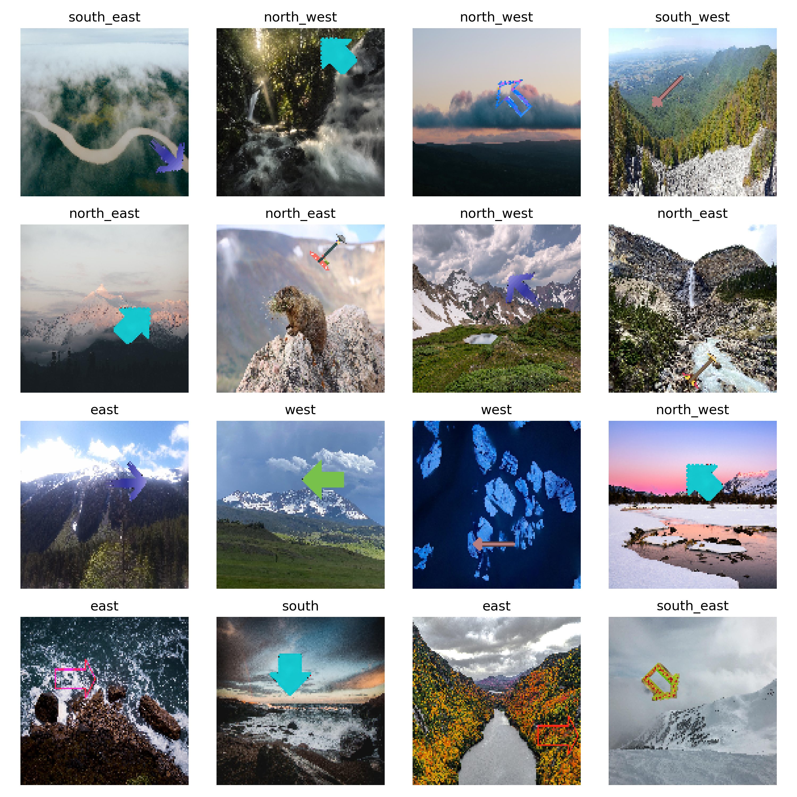

# The Arrow Dataset

## About

This repository contains scripts that generate the arrow dataset. This dataset contains
images that are constructed as follows:

- A background images are selected from the [red_caps](https://huggingface.co/datasets/red_caps)
dataset.
- The arrows are taken from [here](https://www.cleanpng.com/free/arrow-image.html).

Then we sample `n` images from the `red_caps` dataset and overlay the `m` arrows on top
of them. Each arrow is overlayed on each image at a position and random angle `k` times.
This creates a dataset of `n * m * k` images.

We select `n=1000`, `m=10`, and `k=4` to create a dataset of `40,000` images.

## Samples

Here are some samples from the dataset:



## Usage

First, create the virtual environment:

```bash
micromamba create -f environment.yml
```

then activate and run the script:

```bash
micromamba activate arrow-dataset
python generate_dataset.py [-h] [--n N] [--k K] [--arrow-dir ARROW_DIR] [--background-dir BACKGROUND_DIR] [--output-dir OUTPUT_DIR]
```

where the usage is:

```bash
usage: generate_dataset.py [-h] [--n N] [--k K] [--arrow-dir ARROW_DIR] [--background-dir BACKGROUND_DIR] [--output-dir OUTPUT_DIR]

Generate the arrow dataset for training

options:
  -h, --help            show this help message and exit
  --n N                 Number of background images to to use
  --k K                 Number of arrows to place on each background image
  --arrow-dir ARROW_DIR
                        Directory containing arrow images
  --background-dir BACKGROUND_DIR
                        Directory to download the background images to
  --output-dir OUTPUT_DIR
                        Directory to save the generated dataset
```
